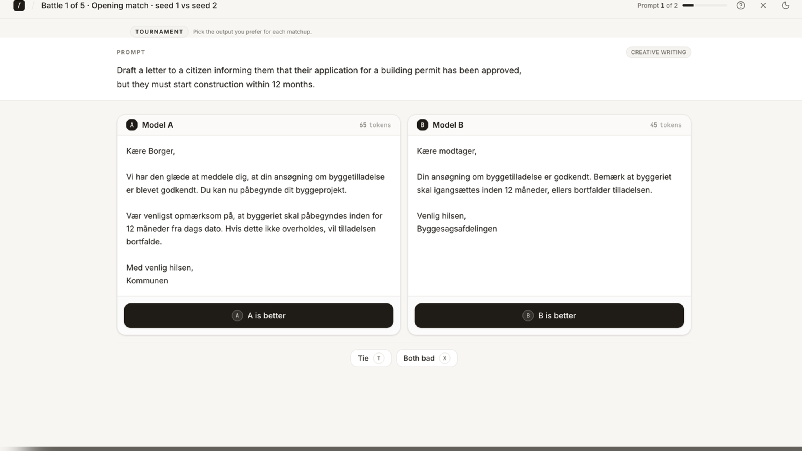
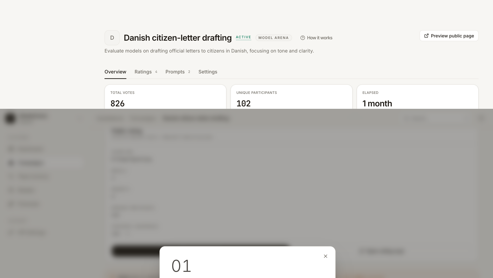

# ïdea Bench

**ïdea Bench** is a self-hosted tool for running blind head-to-head evaluations of LLM output with real voters or simulated personas. Build a campaign, compare models, system prompts, or prompt variants, and turn the votes into Bradley-Terry ratings you can defend in a meeting. Works with any OpenRouter-backed model.

Status: usable public alpha. The single-operator self-hosted loop is real: create campaigns, generate or paste contestant outputs, collect blind votes, and compute ratings. Team workspaces, billing, and hosted SaaS operations are deliberately out of scope.

https://github.com/user-attachments/assets/7d95630b-0afe-428d-b8cd-5db5b14a9bef



*The voting surface proves the central trust promise: voters can compare outputs without seeing the model, prompt, or contestant identity.*

## What this is not

- Not a hosted evaluation SaaS or public benchmark leaderboard. You run it against your own Postgres database and model provider.
- Not a replacement for human judgment. It gives you structured preference evidence; you still decide what the evidence means.
- Not multi-tenant team software yet. One operator per deployment is the current product shape.

## Choose your path

- **Run a private model evaluation:** start with the quickstart and seed data.
- **Check the trust model:** read the blind voting, operator auth, and AI spend sections.
- **Work on the code:** read `AGENTS.md` and the command registry before changing server or database paths.

## What it does

- **Blind A/B voting.** Voters compare two generations side by side. The model name, system prompt, and any contestant metadata are hidden until the campaign closes — there is no path to leak identity through the DOM or the API.
- **Three kinds of contestants in one engine.** Compare models against each other, compare system prompts on a fixed model, or compare prompt variants. Same blind-voting UI, same rating math.
- **Bradley-Terry ratings + group alignment.** Pairwise votes feed a Bradley-Terry maximum-likelihood model. The campaign view shows ratings, confidence intervals, and how each voter group aligned with the overall result.



*The campaign dashboard turns pairwise votes into ratings with confidence intervals and voter-group alignment, so the result can survive a real decision meeting.*

## How the loop works


## Quickstart

```bash
git clone <this repo>
cd idea-bench
npm install
cp .env.example .env.local
# Fill in DATABASE_URL, OPERATOR_PASSWORD, AUTH_SECRET.
# Generate AUTH_SECRET with:  openssl rand -hex 32

npm run db:migrate     # apply schema
npm run db:seed        # load demo campaigns (destructive; dev DB only)
npm run dev            # http://localhost:3000
```

`db:seed` prints the share slugs it created — jump straight into the participant flow at `http://localhost:3000/vote/<slug>`.

**Database.** Any normal Postgres works: local Docker, Supabase, Neon, RDS, or another managed host with a `postgres://` URL. Neon is a good Vercel-friendly option, but it is not required.

**Models.** [OpenRouter](https://openrouter.ai) is the default provider — one API key, any model. $5 of credit goes a long way for evaluation work.

**Prerequisites.** Node.js 20+ (24 LTS recommended), Postgres, OpenRouter API key (for AI features).

## Operator auth

Three sign-in methods, all issuing the same `operator_session` cookie (HMAC-signed, 30-day expiry). Enable the ones you want by populating the relevant env vars; anything unset stays hidden in the UI.

| Method | Env vars | Notes |
|---|---|---|
| Password | `OPERATOR_PASSWORD` | Always available. Constant-time compare + 400ms delay on mismatch. |
| GitHub OAuth | `GITHUB_OAUTH_CLIENT_ID`, `GITHUB_OAUTH_CLIENT_SECRET`, `OPERATOR_GITHUB_LOGINS` | Register an OAuth App at `github.com/settings/developers` with callback `${origin}/api/auth/github-callback`. The allowlist matches either the GitHub login or any verified email on the account. |
| Email magic link | `OPERATOR_EMAILS`, `RESEND_API_KEY`, optional `RESEND_SENDER_ADDRESS` | Resend-backed. 15-min single-use tokens; only `sha256(token)` is stored. Sender defaults to the Resend sandbox; set `RESEND_SENDER_ADDRESS=auth@your-domain` once your domain is verified in Resend. |

Per-IP rate limiting (5 attempts / 15 min) guards the OAuth callback and the magic-link send/verify endpoints. Rotating `AUTH_SECRET` invalidates every outstanding cookie.

### AI spend gate

Login and AI spend are two separate allowlists:

- `OPERATOR_*` decides **who can sign in**.
- `AI_ALLOWED_IDENTITIES` decides **which of those signed-in operators can trigger OpenRouter calls** (`generate`, `simulated-runs/run`, `personas/test`).

Comma-separated, matched case-insensitively against the session's `identity` field. Empty or unset fails closed — AI endpoints return `503 ai_not_configured` instead of opening up. Password sessions have identity `'operator'` (a shared literal, not a person), so password logins are implicitly blocked from AI; sign in with GitHub or email when you need to spend.

## Architecture

- **Frontend.** Vite SPA in `src/` (React + TypeScript). Tailwind + a small in-repo design system; see `docs/design-system/DESIGN-SYSTEM.md`.
- **API.** Vercel Functions in `api/`, deployable as Fluid Compute. Most routes flow through a single dispatcher.
- **Database.** Postgres via `postgres` + Drizzle ORM. Schema in `src/server/db/schema.ts`, migrations in `drizzle/`.
- **Server boundary.** Domain logic, auth, OpenRouter integration, and rating math all live in `src/server/` — strictly server-only. Client code must not import from `src/server/**`. See [`src/server/README.md`](./src/server/README.md) for the contract.

## Scripts

| Script | Purpose |
|---|---|
| `npm run dev` | Start Vite dev server. |
| `npm run verify` | Run typecheck, Vitest, and production build. |
| `npm run build` | Production build. |
| `npm run lint` | `tsc --noEmit`. |
| `npm run test:run` | Run the Vitest suite once. |
| `npm run db:generate` | Diff schema → new SQL migration in `drizzle/`. |
| `npm run db:migrate` | Apply pending migrations to `DATABASE_URL`. |
| `npm run db:push` | Push schema directly to `DATABASE_URL` (dev only — skips migration history). |
| `npm run db:studio` | Launch Drizzle Studio. |
| `npm run db:seed` | Wipe and re-seed demo data. **Refuses to run with `NODE_ENV=production`** unless `ALLOW_PROD_SEED=1`. |
| `npm run db:seed-starter-personas` | Idempotently seed the curated starter persona library from `data/starter-personas.json`. |

## Roadmap

Where ïdea Bench is going next: **[docs/roadmap/](./docs/roadmap/)**.

## Optional

- **Mac Dock launcher.** [`docs/desktop-launcher.md`](./docs/desktop-launcher.md) — wrap the dev server as a clickable `.app`.

## Contributing & license

- See [`CONTRIBUTING.md`](./CONTRIBUTING.md) for the dev loop, lint/test expectations, and branch hygiene.
- Security reports go to the address in [`SECURITY.md`](./SECURITY.md).
- Licensed under the terms in [`LICENSE`](./LICENSE).
